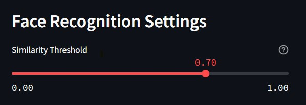
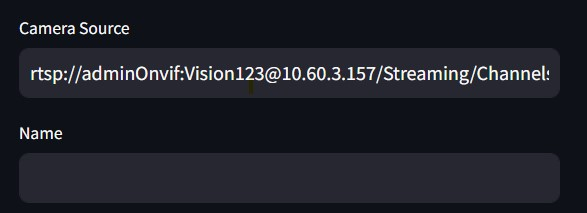

# Thông tin các File

## Các file cần thiết để chạy:
Tất cả đã được để trong folder [FaceRecognition-FAISS](./FaceRecognition-FAISS)

Đưa tất cả file trong folder trên vào máy ssh nếu chưa có. Hiện tại trên SOM đã có các file này. 

## 🚀 Hướng dẫn chạy ứng dụng

### SSH vào máy server
ssh itri@10.60.3.235

### Thiết lập biến môi trường
export LD_LIBRARY_PATH=$LD_LIBRARY_PATH:/home/itri/Working/prebuilt/opencv/lib

export LD_LIBRARY_PATH=$LD_LIBRARY_PATH:$PWD

### Kích hoạt môi trường ảo Python
cd ~/Working/Demo/
source venv_3.8/bin/activate

### Chạy ứng dụng Streamlit
cd ~/Working/NATu/FaceRecognition-FAISS
streamlit run app_streamlit.py

## Build lại file, thay đổi model
Vào folder [face_recognition_sface_2021dec_ovx](./face_recognition_sface_2021dec_ovx), thay đổi file `FaceRecog_wrapper.cpp` để thay đổi đường dẫn các model, thay đổi cách tiền xử lý và hậu xử lý dữ liệu bên ngoài mô hình.

Vào folder [FaceRecog_UI](./FaceRecog_UI) để thay đổi giao diện, cách quản lý các file thông tin người dùng.

Vào folder [FaceRecognition_sface_pybind](./FaceRecognition_sface_pybind) để thêm các hàm mới cần dùng nếu có thêm hàm mới ở file `FaceRecog_wrapper.cpp`.

Sau đó build lại file theo hướng dẫn trong file [README-FaceRecognition.txt](./README-FaceRecognition.txt)

# 🧑‍💻 Face Recognition Attendance System  

Ứng dụng nhận diện khuôn mặt để điểm danh, quản lý người dùng và theo dõi lịch sử ra/vào.  

Hệ thống hỗ trợ cấu hình ngưỡng nhận diện, lựa chọn nguồn camera (USB hoặc IP Cam), đồng thời ghi lại lịch sử truy cập để tiện theo dõi.  

---

## 📊 Bảng lịch sử truy cập  
Ứng dụng có bảng hiển thị **lịch sử ra/vào**, bao gồm:  
- **Tên người dùng**  
- **Thời gian truy cập**  
- **Trạng thái** (đã đăng ký/chưa đăng ký)  

---

## ⚙️ Các khung chức năng  

### 1. Khung hiệu chỉnh độ tương đồng  
- Cho phép điều chỉnh **ngưỡng độ tương đồng** để xác định một người có được coi là đã đăng ký trong hệ thống.  
- **Mặc định:** `0.7`  
- **Khuyến cáo:** trong khoảng `[0.4 – 0.7]`  
- Ngưỡng càng thấp → dễ nhận diện nhầm, ngưỡng càng cao → dễ bỏ sót.  

👉 Minh họa:  
  

---

### 2. Khung camera source  
- Điền **đường dẫn IP Camera** để sử dụng camera IP.  
- Điền `0` để sử dụng **USB Camera** (mặc định).  

👉 Minh họa:  
  

---

## 🎛️ Danh sách nút chức năng  

- **Start Camera** → Bắt đầu kết nối với camera.  
- **Name + Regis** → Nhập tên vào ô **Name**, sau đó bấm **Regis** để đăng ký người dùng mới.  
- **Reset user** → Xóa toàn bộ thông tin (bao gồm dữ liệu người dùng & lịch sử ra/vào).  
- **Stop Camera** → Ngắt kết nối camera.  
👉 Minh họa:  
  
---

